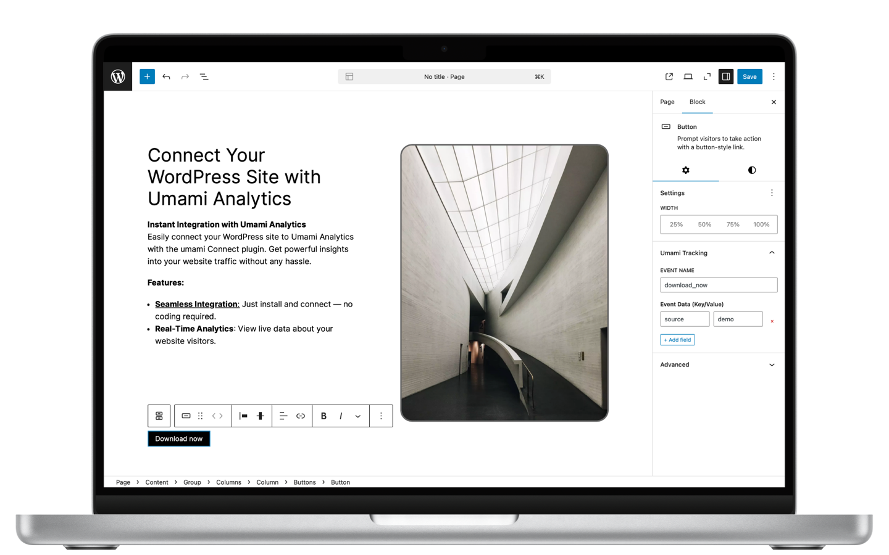
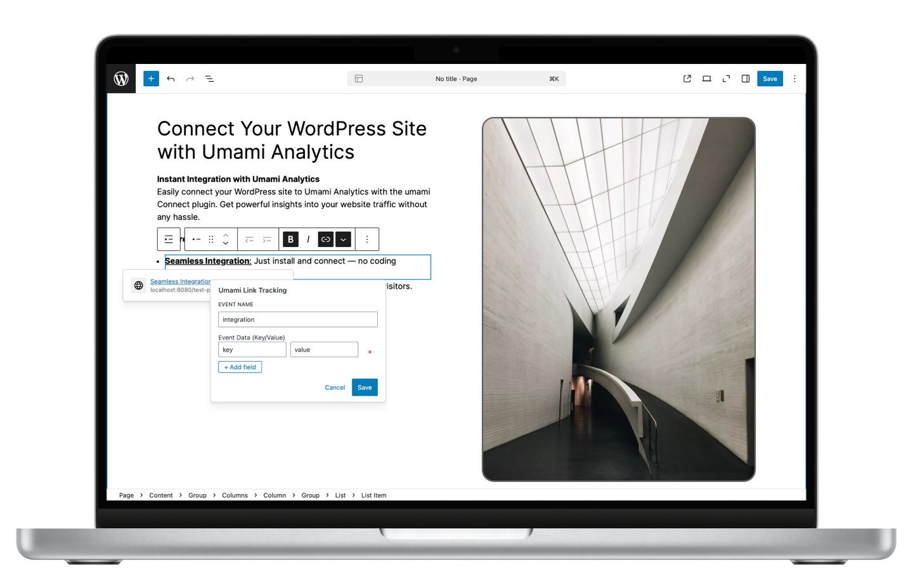
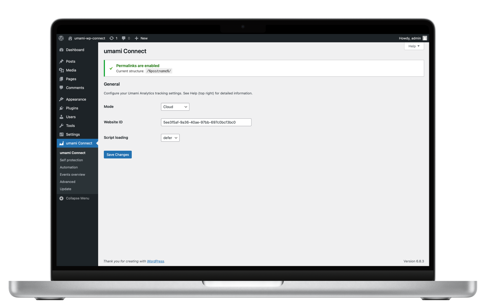
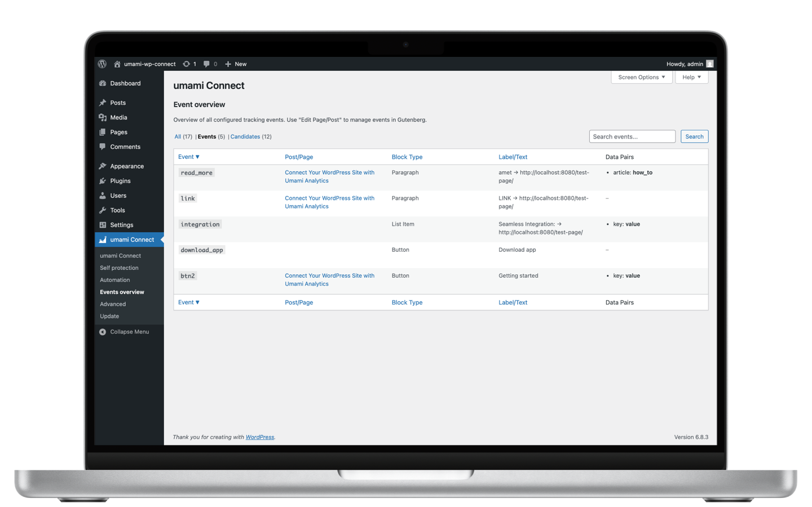

# umami Connect for WordPress

> **Privacy-first website analytics made simple** — Connect your WordPress site to [Umami Analytics](https://umami.is) in minutes, not hours.

Transform how you understand your website visitors with **umami Connect** — the most user-friendly WordPress plugin for privacy-focused analytics. Whether you're a blogger, business owner, or agency managing client sites, get powerful insights without compromising your visitors' privacy or dealing with complex setup processes.

[](https://github.com/ceviixx/umami-wp-connect/releases/latest)
[](https://github.com/ceviixx/umami-wp-connect/releases)
[](https://github.com/ceviixx/umami-wp-connect/blob/main/LICENSE)
[](https://github.com/ceviixx/umami-wp-connect/issues)
[](https://github.com/ceviixx/umami-wp-connect/discussions)
[](https://discord.gg/84w4CQU7Jb)

[](https://wordpress.org/)
[](https://php.net/)

<div align="center">
  
</div>

<table align="center">
  <tr>
    <td align="center"></td>
    <td align="center"></td>
    <td align="center"></td>
    <td align="center"></td>
  </tr>
</table>

---

## Key Features

- **Visual Event Tracking** — Add tracking to buttons and links directly in Gutenberg editor
- **Smart Auto-Tracking** — Automatically track links, buttons, and form submissions  
- **Privacy Controls** — Self-protection mode, Do Not Track support, domain restrictions
- **Event Management** — View and manage all your tracking from one dashboard
- **Advanced Options** — beforeSend hooks, custom tagging, URL cleanup

---

## Installation

1. **Download** the latest release from the [GitHub Releases page](https://github.com/ceviixx/umami-wp-connect/releases)
2. **Upload** via WordPress Admin → Plugins → Add New → Upload Plugin
3. **Activate** the plugin
4. **Configure** via Settings → umami Connect

---

## Need Help?

- **GitHub Issues:** [Report bugs or request features](https://github.com/ceviixx/umami-wp-connect/issues)
- **GitHub Discussions:** [Community questions and support](https://github.com/ceviixx/umami-wp-connect/discussions)
- **Discord Community:** [Join the community](https://discord.gg/84w4CQU7Jb) for quick help and discussions

---

<div align="center">

### Ready to Integrate?

[**Download Latest Release**](https://github.com/ceviixx/umami-wp-connect/releases/latest) • [**View Documentation**](https://github.com/ceviixx/umami-wp-connect) • [**Join Community**](https://discord.gg/84w4CQU7Jb)

</div>

---

## 🎯 First8 Marketing Integration

This plugin is a core component of the **First8 Marketing Hyper-Personalized System**, serving as the **data collection bridge** between WordPress/WooCommerce and the analytics infrastructure.

### Role in First8 Marketing System

**First8 Marketing Track** connects your WordPress site to the enhanced Umami Analytics instance, enabling:

- **Comprehensive Event Tracking** - All WordPress core events and WooCommerce interactions
- **Real-time Data Pipeline** - Seamless integration with the recommendation engine
- **Privacy-First Analytics** - GDPR-compliant tracking without compromising user privacy
- **Multi-dimensional Data Collection** - Contextual, behavioral, temporal, and journey tracking

### System Architecture

```
WordPress/WooCommerce → First8 Marketing Track → Umami Analytics → Recommendation Engine
```

**Data Flow:**
1. **WordPress Events** - Page views, clicks, form submissions, user interactions
2. **WooCommerce Events** - Product views, add to cart, purchases, checkout steps
3. **Custom Events** - Visual tracking via Gutenberg blocks, custom tagging
4. **Analytics Storage** - Events sent to Umami (PostgreSQL 17 + Apache AGE + TimescaleDB)
5. **ETL Pipeline** - Real-time sync to recommendation engine for ML processing
6. **Personalization** - Insights drive hyper-personalized content and product recommendations

### Enhanced Features for First8 Marketing

**Extended Event Tracking:**
- ✅ All standard Umami events (page views, clicks, custom events)
- ✅ WooCommerce product views and interactions
- ✅ Add to cart and cart modifications
- ✅ Checkout process tracking
- ✅ Purchase completion and order details
- ✅ User journey and session tracking
- ✅ Search queries and filters
- ✅ Category and tag navigation

**Integration Points:**
- **Umami Analytics** - Enhanced instance with PostgreSQL 17, Apache AGE, TimescaleDB
- **Recommendation Engine** - Proprietary ML backend for hyper-personalization
- **First8 Marketing Recommendation Engine Plugin** - Displays personalized content

**Privacy & Compliance:**
- Self-protection mode to prevent tracking on admin pages
- Do Not Track (DNT) header support
- Domain restrictions for security
- GDPR-compliant data collection
- No cookies required (optional)

### Installation for First8 Marketing System

**Prerequisites:**
- WordPress 5.0+
- PHP 7.4+
- WooCommerce 7.0+ (for e-commerce tracking)
- Umami Analytics instance (with First8 Marketing enhancements)

**Setup Steps:**

1. **Install Plugin:**
   ```bash
   # Upload to WordPress plugins directory
   wp-content/plugins/first8marketing-track/
   ```

2. **Activate Plugin:**
   - WordPress Admin → Plugins → Activate "First8 Marketing - Track"

3. **Configure Connection:**
   - Settings → umami Connect
   - Enter Umami Analytics URL (e.g., `https://analytics.yourdomain.com`)
   - Enter Website ID from Umami dashboard
   - Configure tracking options (auto-tracking, privacy settings)

4. **Enable WooCommerce Tracking:**
   - Ensure WooCommerce is installed and active
   - Plugin automatically detects and tracks WooCommerce events

5. **Test Connection:**
   - Visit your website
   - Check Umami dashboard for incoming events
   - Verify WooCommerce events are being tracked

### Configuration Options

**General Settings:**
- Umami Analytics URL
- Website ID
- Tracking script location (header/footer)
- Auto-tracking enabled/disabled

**Privacy Settings:**
- Self-protection mode (don't track admins)
- Do Not Track support
- Domain restrictions
- IP anonymization

**Event Tracking:**
- Visual event tracking in Gutenberg
- Auto-track links and buttons
- Form submission tracking
- Custom event tagging

**WooCommerce Settings:**
- Product view tracking
- Add to cart tracking
- Checkout step tracking
- Purchase completion tracking

### Usage Examples

**Visual Event Tracking:**
1. Edit any page/post in Gutenberg
2. Select a button or link block
3. Enable "Track with Umami" in block settings
4. Set custom event name
5. Events automatically sent to Umami

**Custom Event Tracking (PHP):**
```php
// Track custom event
do_action('umami_track_event', 'newsletter_signup', [
    'location' => 'footer',
    'user_type' => 'subscriber'
]);
```

**WooCommerce Integration:**
```php
// Automatically tracked events:
// - Product view: 'product_view' with product ID and details
// - Add to cart: 'add_to_cart' with product and quantity
// - Checkout step: 'checkout_step_1', 'checkout_step_2', etc.
// - Purchase: 'purchase' with order details and revenue
```

### Integration with Recommendation Engine

The tracking data collected by this plugin feeds into the First8 Marketing Recommendation Engine:

**Data Used for Personalization:**
- User browsing patterns and product views
- Cart behavior and abandoned carts
- Purchase history and preferences
- Session duration and engagement
- Navigation paths and journey mapping
- Search queries and filter usage

**Resulting Personalization:**
- Product recommendations based on behavior
- Dynamic content personalization
- Personalized email campaigns
- Context-aware suggestions
- Sequential pattern predictions

### Troubleshooting

**Events Not Appearing in Umami:**
- Verify Umami URL and Website ID are correct
- Check browser console for JavaScript errors
- Ensure tracking script is loaded (view page source)
- Verify domain restrictions allow your site

**WooCommerce Events Not Tracking:**
- Confirm WooCommerce is active
- Check WooCommerce version (7.0+ required)
- Verify product pages load correctly
- Test with browser console open to see event calls

**Privacy/GDPR Concerns:**
- Enable Do Not Track support
- Configure IP anonymization
- Review Umami's privacy-first approach
- No personal data stored without consent

### Credits

**Original Plugin:**
- **umami Connect for WordPress** - Created by [ceviixx](https://github.com/ceviixx)
- Licensed under MIT License
- Original repository: [github.com/ceviixx/umami-wp-connect](https://github.com/ceviixx/umami-wp-connect)

**First8 Marketing Customization:**
- **Integration & Enhancement** - First8 Marketing
- Renamed to "First8 Marketing - Track"
- Extended WooCommerce event tracking
- Integration with recommendation engine ETL pipeline
- Enhanced privacy and compliance features
- Custom event tracking capabilities

### Related Components

**First8 Marketing Hyper-Personalization System:**
- **Umami Analytics** - Enhanced analytics platform (PostgreSQL 17 + Apache AGE + TimescaleDB)
- **First8 Marketing Track** - This plugin (WordPress → Umami connector)
- **Recommendation Engine** - Proprietary ML backend (not public)
- **First8 Marketing Recommendation Engine Plugin** - WordPress connector for personalized content

---

## 📄 License

This project maintains the original MIT License from the umami Connect plugin.

**Original Author:** ceviixx
**Integration & Customization:** First8 Marketing

---

*This plugin is based on umami Connect and is not officially affiliated with Umami Analytics. First8 Marketing has extended and integrated it into a comprehensive hyper-personalization system.*