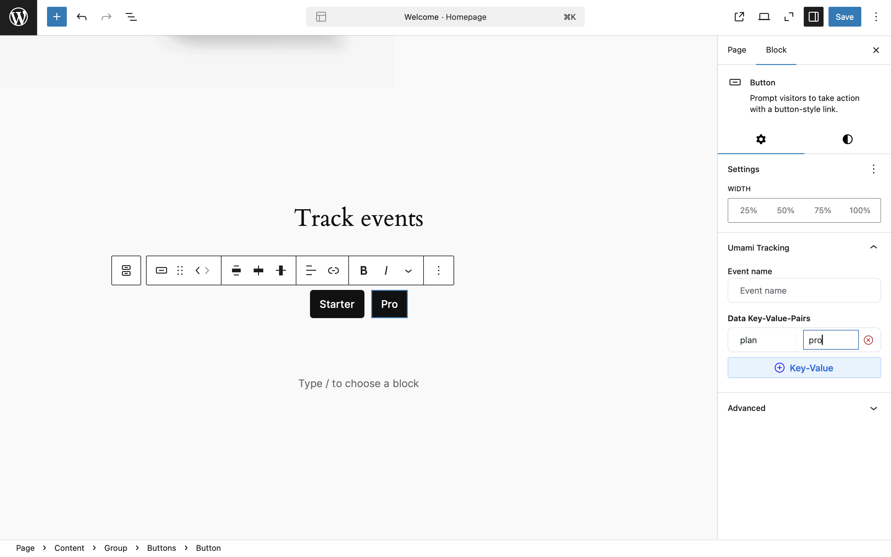
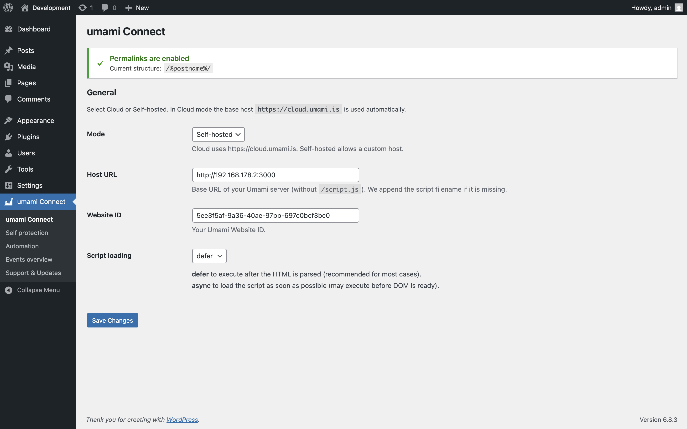
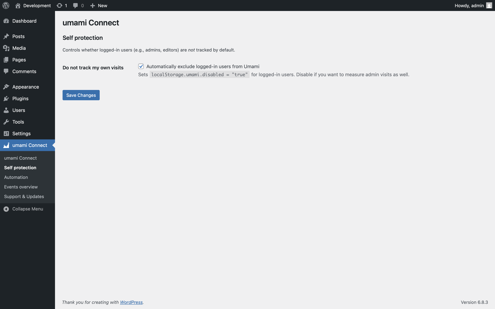
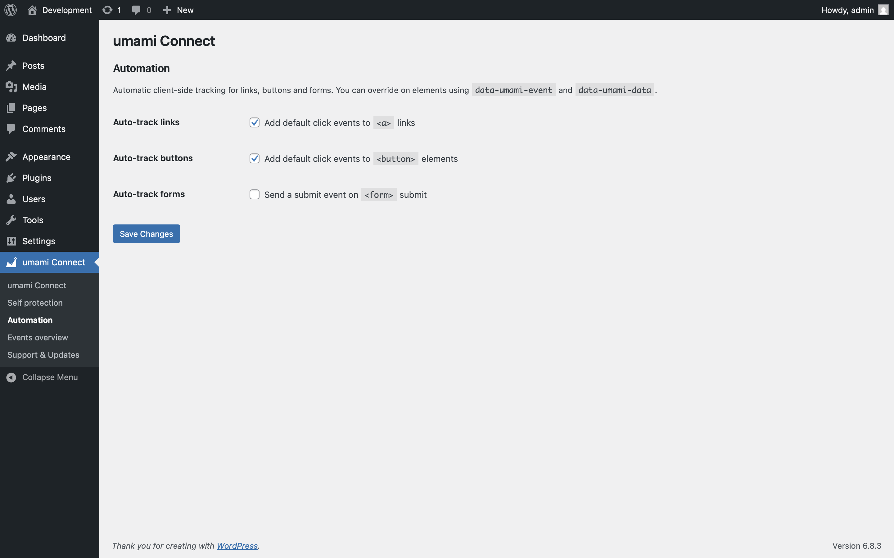
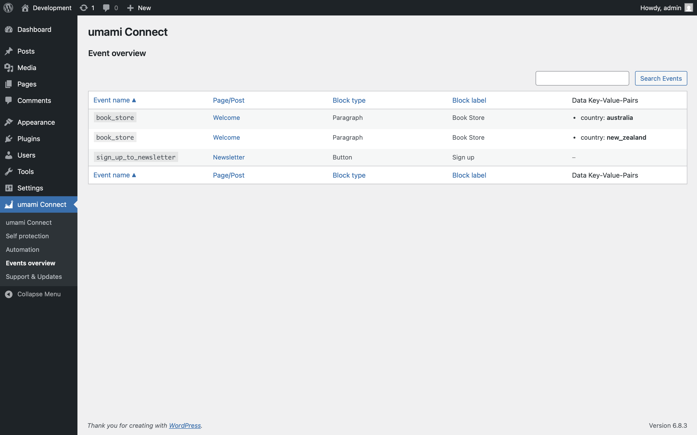

# Umami Connect for WordPress

> **Privacy-first website analytics made simple** — Connect your WordPress site to [Umami Analytics](https://umami.is) in minutes, not hours.

Transform how you understand your website visitors with **Umami Connect** — the most user-friendly WordPress plugin for privacy-focused analytics. Whether you're a blogger, business owner, or agency managing client sites, get powerful insights without compromising your visitors' privacy or dealing with complex setup processes.

[](https://github.com/ceviixx/umami-wp-connect/releases/latest)
[](https://github.com/ceviixx/umami-wp-connect/releases)
[](https://github.com/ceviixx/umami-wp-connect/issues)
[](https://github.com/ceviixx/umami-wp-connect/discussions)
[](https://discord.gg/84w4CQU7Jb)

[](https://wordpress.org/)
[](https://php.net/)

---

## 🎯 Why Choose Umami Connect?

### ✅ **Privacy-First Analytics**
Umami Analytics is designed with privacy in mind - no cookies, no personal data collection. This plugin seamlessly integrates Umami's privacy-focused approach into WordPress.

### ⚡ **Quick & Easy Setup**
Choose Cloud or Self-hosted, enter your Website ID (and Host URL if self-hosted) — you're done. No technical knowledge required.

> 💡 **Pro tip:** Enable WordPress pretty permalinks for the most accurate page tracking.

### 🎨 **WordPress Native Experience** 
Built specifically for WordPress with Gutenberg integration. Manage everything from your familiar WordPress admin interface.

### 📊 **Smart Event Tracking**
Track button clicks, link interactions, and form submissions automatically — or customize exactly what matters to you.


---

## 🚀 Perfect for Every WordPress Site

<table align="center">
<tr>
<td align="center" width="50%">

### 📝 **Content Creators & Bloggers**
Track which articles engage readers most, monitor social shares, and understand your audience without invading their privacy.

</td>
<td align="center" width="50%">

### 🏢 **Business Websites**
Measure conversion funnels, track contact form submissions, and monitor customer journeys across your site.

</td>
</tr>
</table>

---

## 📸 See It in Action

> **🚧 Screenshots Update Coming Soon** — All screenshots are being refreshed to showcase the latest features and modern interface. Check back soon for the updated visual tour!

<table>
  <tr>
   <td></td>
    <td></td>
    <td></td>
    <td></td>
    <td></td>
  </tr>
</table>

---

## 🌟 What Makes This Plugin Special

### 🎯 **Intelligent Auto-Tracking**
**Stop manually tagging every element.** Smart automation detects and tracks:
- **Navigation clicks** — Understand how users move through your site
- **Button interactions** — Measure engagement with your call-to-actions  
- **Form submissions** — Track conversions without complex setup
- **Content engagement** — See which sections capture attention

### 🎨 **Seamless Gutenberg Integration**
**Track custom events without touching code.** Use the visual block editor to:
- Add event tracking to any button with the sidebar panel
- Track link clicks within paragraphs, headings, and content blocks
- Preview exactly what will be tracked before publishing
- Manage all your events from one central dashboard

### 🛡️ **Advanced Privacy Controls**
**Respect your visitors while getting insights you need:**
- **Self-protection mode** — Exclude your own visits from analytics
- **Do Not Track respect** — Honor browser privacy preferences  
- **Privacy-focused** — No personal data collection by design
- **Custom domain restrictions** — Control exactly where tracking runs

### ⚙️ **Professional-Grade Configuration**
**Powerful options for advanced users:**
- **beforeSend hooks** — Modify or filter events before they're sent
- **Custom event tagging** — Organize analytics by campaign, region, or category
- **URL cleanup options** — Control what URL data gets tracked
- **Host override** — Use CDNs or custom collector endpoints

### 📈 **Complete Event Management**
**See and control all your tracking in one place:**
- **Events Overview dashboard** — Visual list of all configured tracking
- **Search and filter** — Find specific events across your entire site
- **Quick edit links** — Jump directly to edit pages and posts
- **Event validation** — Ensure tracking works correctly before going live

---

## 📦 Quick Installation

### Method 1: Direct Download (Recommended)
1. **Download** the latest release from the [GitHub Releases page](https://github.com/ceviixx/umami-wp-connect/releases)
2. **Upload** via WordPress Admin → Plugins → Add New → Upload Plugin
3. **Activate** the plugin
4. **Configure** via the new "Umami Connect" menu in your WordPress admin

### Method 2: Manual Installation
```bash
# Clone to your WordPress plugins directory
git clone https://github.com/ceviixx/umami-wp-connect.git wp-content/plugins/umami-wp-connect
```

---

## 🎯 Smart Auto-Tracking Setup

Navigate to **Umami Connect → Automation** to enable intelligent tracking:

### 📎 **Auto-track Links**
Automatically monitor all navigation and external link clicks. Perfect for understanding user flow and content engagement.

### 🔘 **Auto-track Buttons**  
Capture interactions with all Gutenberg button blocks and HTML buttons. Ideal for measuring call-to-action performance.

### 📝 **Auto-track Forms**
Record form submissions across your site. Essential for tracking conversions, newsletter signups, and contact requests.

---

## 🎨 Custom Event Tracking

### In the Gutenberg Editor

**For Buttons:**
1. Select any Button block
2. Open the **"Umami Tracking"** panel in the sidebar
3. Add your **Event Name** (e.g., "Download Brochure", "Start Free Trial")
4. Add **custom data pairs** for context (category, value, etc.)

**For Inline Links:**
1. Select text with a link in paragraphs, headings, or lists
2. Click the **"Umami Tracking"** button in the toolbar
3. Configure your event name and data
4. See the tracking indicator in the editor

### Event Management Dashboard

Visit **Umami Connect → Events Overview** to:
- **See all configured events** across your entire site
- **Search by event name** or post title
- **Filter by type** (Events, Candidates, or All)
- **Quick edit** any page or post with tracking
- **Validate** that events are working correctly

---

## 🔧 Advanced Configuration

Access **Umami Connect → Advanced** for professional-grade options:

### 🌐 **Host URL Override**
Route analytics through CDNs or custom domains for performance optimization.

### 🎯 **Domain Restrictions**  
Limit tracking to specific hostnames — perfect for staging vs. production environments.

### 🏷️ **Event Tagging**
Add global tags to segment analytics by campaign, region, user type, or any custom category.

### 🧹 **URL Cleanup**
Remove query parameters or hash fragments from page views for cleaner analytics data.

### ⚙️ **beforeSend Hooks**
**Three powerful modes for advanced users:**

#### 🔴 **Disabled Mode**
No preprocessing — events sent directly to Umami (default and recommended for most users).

#### 🔗 **Function Name Mode**
Reference a global JavaScript function for event processing:
- Enter function name (e.g., `MyApp.analytics.beforeSend`)
- Use built-in validation to test function availability
- Perfect for developers with existing analytics infrastructure

#### 📝 **Inline Script Mode**  
Write custom JavaScript directly in the admin:
- Full editor with syntax validation
- Test function before saving
- Real-time error checking and validation
- Ideal for custom filtering or data enrichment

---

## 🛡️ Privacy & Protection

### 🙈 **Self-Protection**
Enable **"Do not track my own visits"** in **Umami Connect → Self Protection** to exclude logged-in WordPress users from analytics. Keep your data focused on real visitors, not your own site management activities.

### 🚫 **Do Not Track Support**
Respect visitors who enable Do Not Track in their browsers — configure in Advanced settings.

### 🔒 **Privacy by Design**
Umami Analytics is built with privacy as a core principle. For current details about privacy features, see the [official Umami documentation](https://umami.is/docs).

---

## 🆘 Need Help?

### 📖 **Documentation & Tutorials**
- **Built-in help:** Every admin page includes contextual help tabs
- **Umami docs:** [Official Umami documentation](https://umami.is/docs)
- **WordPress integration:** Help panels explain each feature in detail

### 💬 **Community Support**
- **GitHub Issues:** [Report bugs or request features](https://github.com/ceviixx/umami-wp-connect/issues)
- **GitHub Discussions:** [Community questions and support](https://github.com/ceviixx/umami-wp-connect/discussions)
- **Discord Community:** [Join the community](https://discord.gg/84w4CQU7Jb) for quick help and discussions

---

<div align="center">

### Ready to Integrate?

[**📥 Download Latest Release**](https://github.com/ceviixx/umami-wp-connect/releases/latest) • [**📝 View Documentation**](https://github.com/ceviixx/umami-wp-connect) • [**💬 Join Community**](https://discord.gg/84w4CQU7Jb)

</div>

---

*Umami Connect is an independent WordPress plugin and is not officially affiliated with Umami Analytics.*
