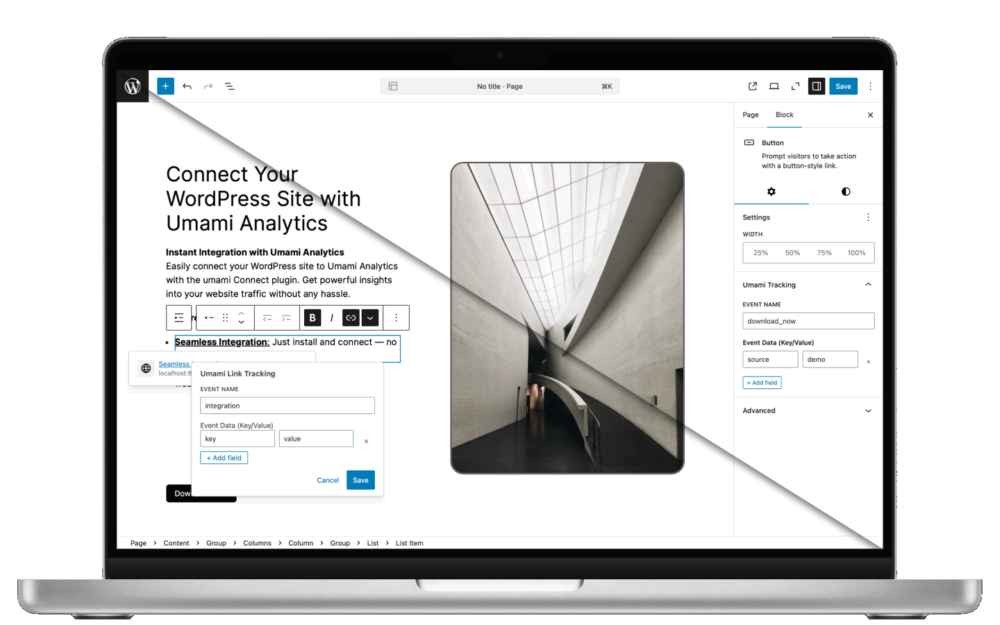

# umami Connect for WordPress

> **Privacy-first website analytics made simple** — Connect your WordPress site to [Umami Analytics](https://umami.is) in minutes, not hours.

Transform how you understand your website visitors with **umami Connect** — the most user-friendly WordPress plugin for privacy-focused analytics. Whether you're a blogger, business owner, or agency managing client sites, get powerful insights without compromising your visitors' privacy or dealing with complex setup processes.

  

<table align="center">
  <tr>
    <td align="center"></td>
    <td align="center"></td>
    <td align="center"></td>
    <td align="center"></td>
  </tr>
</table>

---

## Key Features

- **Visual Event Tracking** — Add tracking to buttons and links directly in Gutenberg editor
- **Smart Auto-Tracking** — Automatically track links, buttons, and form submissions  
- **Privacy Controls** — Self-protection mode, Do Not Track support, domain restrictions
- **Event Management** — View and manage all your tracking from one dashboard
- **Advanced Options** — beforeSend hooks, custom tagging, URL cleanup

---

## Installation

1. **Download** the latest release from the [GitHub Releases page](https://github.com/ceviixx/umami-wp-connect/releases)
2. **Upload** via WordPress Admin → Plugins → Add New → Upload Plugin
3. **Activate** the plugin
4. **Configure** via Settings → umami Connect

---

## Need Help?

- **GitHub Issues:** [Report bugs or request features](https://github.com/ceviixx/umami-wp-connect/issues)
- **GitHub Discussions:** [Community questions and support](https://github.com/ceviixx/umami-wp-connect/discussions)
- **Discord Community:** [Join the community](https://discord.gg/84w4CQU7Jb) for quick help and discussions

---

### Ready to Integrate?

[**Download Latest Release**](https://github.com/ceviixx/umami-wp-connect/releases/latest) • [**View Documentation**](https://github.com/ceviixx/umami-wp-connect) • [**Join Community**](https://discord.gg/84w4CQU7Jb)

---

*umami Connect is an independent WordPress plugin and is not officially affiliated with Umami Analytics.*